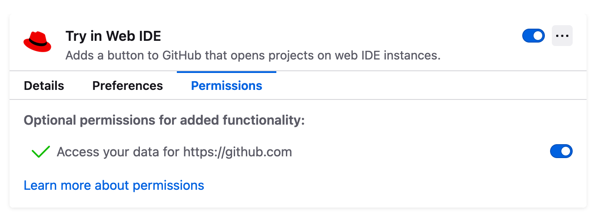
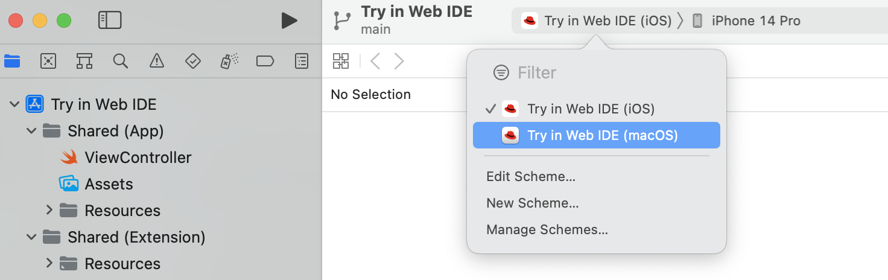
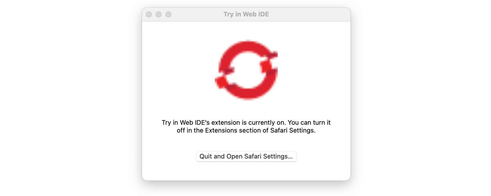
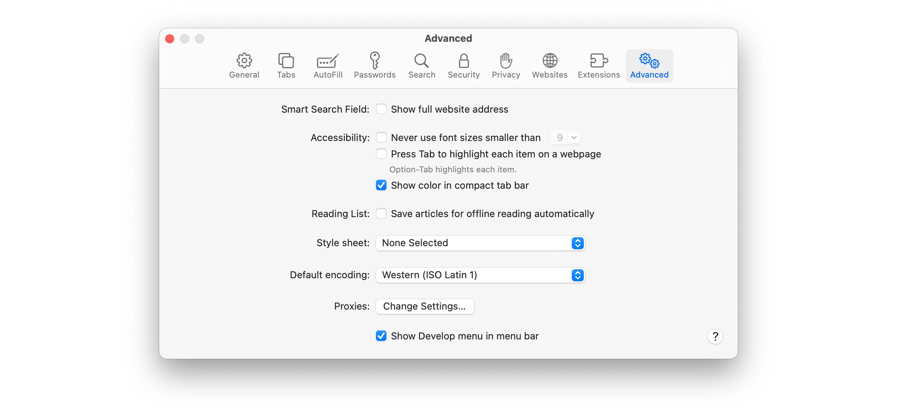
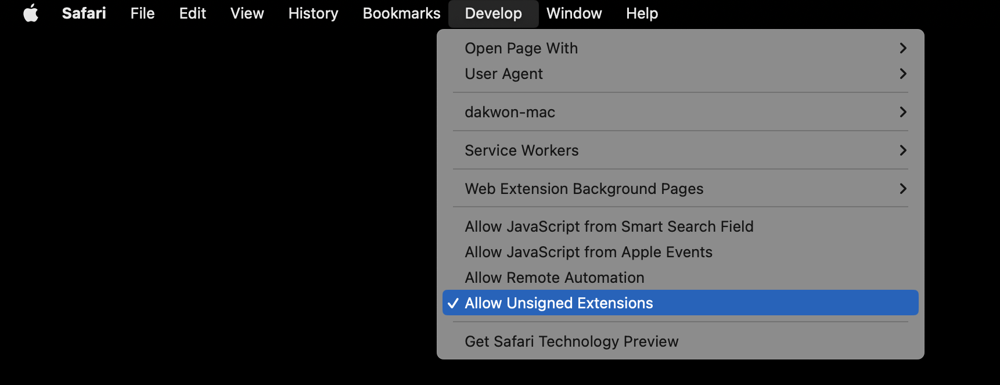
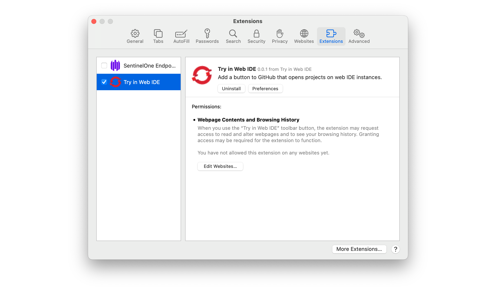
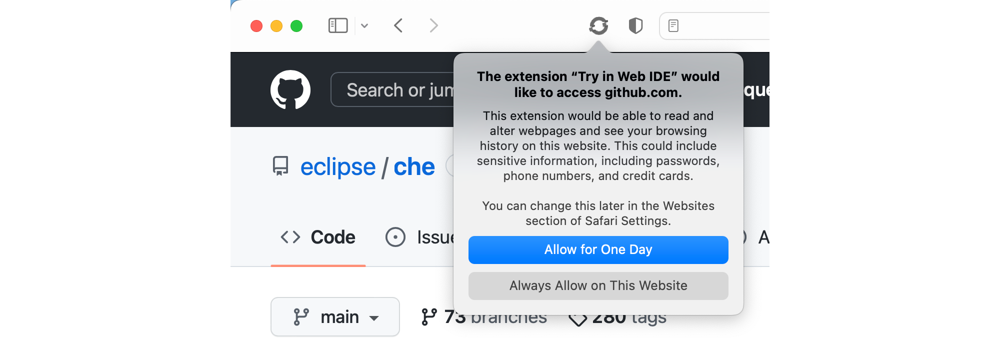

# Sideloading the extension to different browsers

After building the extension, sideload the extension located under the `dist` folder.

## Chromium-based browsers (Google Chrome, Microsoft Edge, Brave, etc.)
1. Open the extensions page by visiting `chrome://extensions`, `edge://extensions`, `brave://extensions`, etc.
2. Enable `Developer mode`.
3. Click `Load unpacked` and provide the location to the `dist/chromium` folder.
4. In the extension's `Permissions` tab, provide the permissions to access data for `https://github.com`.

## Firefox version
1. Open the `about:debugging` page.
2. Navigate to `This Firefox`.
3. Click `Load Temporary Add-on` then select any file in the `dist/firefox-safari` folder.
4. Open the `about:addons` page.
5. Under the extensions `Permissions` tab, provide permissions for the extension to access data on `https://github.com`.



## Safari version
To sideload the extension on Safari, Xcode is required.

1. Open the terminal and run the following to create and open an Xcode project for the web extension:
```
xcrun safari-web-extension-converter /path/to/dist/firefox-safari
```
2. In the Xcode project, set the build target to `Try in Dev Spaces (macOS)` and start the build by pressing ▶.



3. After the build, press `Quit and Open Safari Settings...` on the following window.



4. In the Safari settings, navigate to `Advanced` and check `Show Develop menu in menu bar`.



5. In the Develop menu, enable `Allow Unsigned Extensions`.



6. Enable the `Try in Dev Spaces` extension from the Safari settings.



7. When prompted by the extension, allow access to `github.com`.


