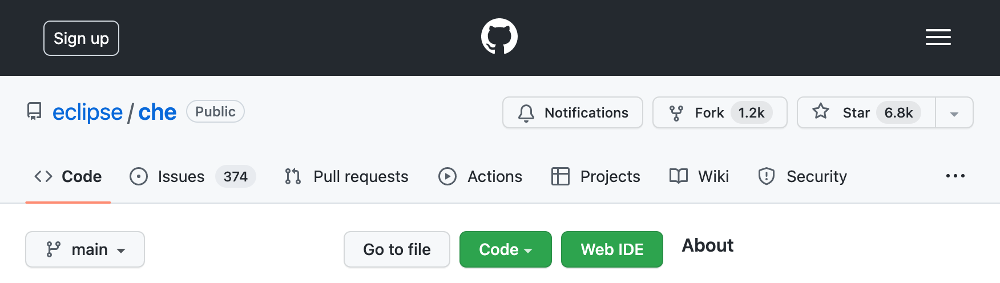

# Try in Web IDE Browser Extension

This web extension adds a `Web IDE` on every GitHub repository page that starts a new workspace based on the current repository.



By default, the new workspace is created on the [Eclipse Che® hosted by Red Hat instance](https://developers.redhat.com/developer-sandbox/ide).

Additional instances can configured from the extension's options.

## Extension permissions

 - Requires `storage` permissions to lerverage the [Storage API](https://developer.chrome.com/docs/extensions/reference/storage/) to allow your options to be saved locally and synced across devices.

 - Access to your data on github.com. This is required to determine the factory url for the button, and for injecting the button element into the webpage.

## Quick start

1. Build the extension. This command creates a `dist` folder containing the built extension.
```
$ yarn build
```
&nbsp;&nbsp;&nbsp;&nbsp;&nbsp;&nbsp;
For development, run `yarn watch` to watch the source files to recompile on changes.

2. Sideload the extension located in the `dist` folder into your web browser.
For instructions for different web browsers, refer to [CONTRIBUTING.md](./CONTRIBUTING.md).
