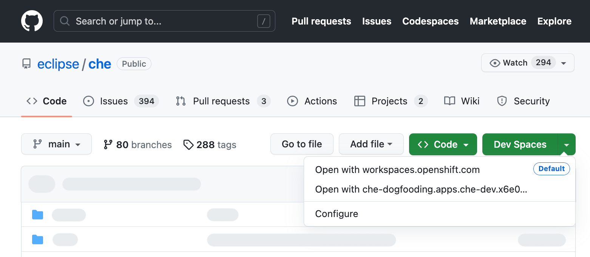

# Try in Dev Spaces Browser Extension
[](https://workspaces.openshift.com#https://github.com/redhat-developer/try-in-dev-spaces-browser-extension)

This web extension adds a `Dev Spaces` button on every GitHub repository page that starts a new workspace based on the current repository.



By default, the new workspace is created on the [Eclipse Che® hosted by Red Hat instance](https://developers.redhat.com/developer-sandbox/ide).

Additional Dev Spaces (and upstream Eclipse Che®) instances can configured from the extension's options.

## Downloading the extension

Chromium-based browsers             |  Safari |  Firefox
:-------------------------:|:-------------------------:|:-------------------------:
<a href="https://chrome.google.com/webstore/detail/try-in-dev-spaces/gbookaeilomckmoofeocnkfidfeendan"></a> |  <a href="https://apps.apple.com/us/app/try-in-dev-spaces/id6446597744"></a> | <a href="https://addons.mozilla.org/en-US/firefox/addon/try-in-dev-spaces"></a>

## Extension permissions

 - Requires `storage` permissions to leverage the [Storage API](https://developer.chrome.com/docs/extensions/reference/storage/) to allow your options to be saved locally and synced across devices.

 - Requires `scripting` permissions to allow the background script to inject the content script based on new conditions set by the user. More specifically, when setting new GitHub Enterprise instances from the extension options page, the extension needs scripting permissions to inject the "Dev Spaces" button on the user-provided GitHub Enterprise instances.

 - Access to your data on `github.com` (and GitHub Enterprise domains if applicable). This is required to determine the factory url for the button, and for injecting the button element into the webpage.

## Building and running locally

The extension can be built for both Chromium based browsers and for Firefox/Safari.
There are two builds because the two platforms have different manifest V3 definitions.

1. Download dependencies.
```
$ yarn
```

2. Run the build.

&nbsp;&nbsp;&nbsp;&nbsp;&nbsp;&nbsp;
To build for Chromium-based browsers:
```
$ yarn build
```
&nbsp;&nbsp;&nbsp;&nbsp;&nbsp;&nbsp;
To build for Safari:
```
$ yarn build:safari
```
&nbsp;&nbsp;&nbsp;&nbsp;&nbsp;&nbsp;
To build for Firefox:
```
$ yarn build:firefox
```
&nbsp;&nbsp;&nbsp;&nbsp;&nbsp;&nbsp;
Once complete, the built extension will be located in either `dist/chromium` or `dist/safari` or `dist/firefox`.

&nbsp;&nbsp;&nbsp;&nbsp;&nbsp;&nbsp;
For development, run `yarn watch`, `yarn watch:safari`, or `yarn watch:firefox` to watch the source files to recompile on changes.

3. Sideload the extension located under the `dist` folder into your web browser.
For instructions for different web browsers, refer to [CONTRIBUTING.md](./CONTRIBUTING.md).

## Running and sideloading the production build

#### Chromium-based browsers (Google Chrome, Microsoft Edge, Brave, etc.)
```
yarn build:prod
```
The built location is located in `dist/chromium`.

#### For Safari
```
# the built extension is located in dist/safari-firefox
yarn build:prod-safari
```
The built location is located in `dist/safari-firefox`.

#### For Firefox
```
# the built extension is located in dist/firefox
yarn build:prod-firefox
```
The built location is located in `dist/safari-firefox`.

#### Sideloading the extension into the web browser
Refer to [CONTRIBUTING.md](./CONTRIBUTING.md).

## Building zip files for Chromium and Firefox releases
Run the following command to build and create a zip file required when uploading to the Chrome Web Store and the Firefox Add-on Marketplace.

The Chromium extension zip file will be generated under `zip/chromium.zip` and the Firefox add-on zip will be generated under `zip/firefox.zip`.
```
yarn build:zip
```

## Running tests
```
$ yarn test
```
